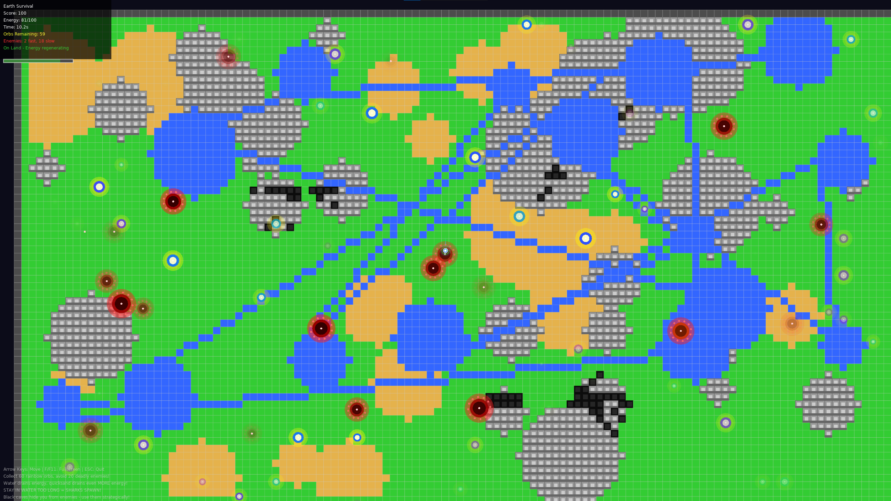

# Earth Survival

A Love2D survival game featuring procedural world generation, enemy AI, and dynamic gameplay mechanics.


*Gameplay showing the procedural world, player character, enemies, and UI elements*

## Features

- **Procedural World**: Large 120x68 tile world with grass, water, mountains, caves, and quicksand
- **Dynamic Camera**: Smooth camera following with zoom and screen shake effects
- **Player Mechanics**: Energy system, invincibility power-ups, particle trails
- **Enemy AI**: Fast and slow enemies with search behavior and cave avoidance
- **Hazards**: Sharks in water, quicksand that slows movement
- **Collectibles**: Energy orbs and invincibility stars
- **Dynamic UI**: Real-time status displays and game information

## Controls

- **WASD/Arrow Keys**: Move player
- **F/F11**: Toggle fullscreen
- **ESC**: Quit game
- **R**: Restart (when game over/victory)

## Running the Game

### Windows
```powershell
& "C:\Program Files\LOVE\love.exe" .
```

### Linux/Mac
```bash
love .
```

## Testing

The game includes a comprehensive test suite with 100% function coverage.

### Run Tests
```powershell
# Windows (PowerShell - recommended)
.\run_tests.ps1

# Windows (Batch)
run_tests.bat

# Linux/Mac
./run_tests.sh
```

### Generate Coverage Report
```powershell
.\generate_coverage_report.ps1
```

See `TEST_DOCUMENTATION.md` for detailed testing information.

## Requirements

- Love2D 11.0 or later
- Windows/Linux/Mac

## Game Mechanics

### Terrain Types
- **Grass**: Safe movement
- **Water**: Slows player, drains energy, spawns sharks
- **Quicksand**: Heavily slows player, high energy drain
- **Mountains**: Impassable for player, passable for enemies
- **Caves**: Hiding spots where enemies can't find you

### Enemies
- **Fast Enemies**: 2 fast enemies with high speed
- **Slow Enemies**: Multiple slower enemies
- **AI Behavior**: Chase player, search when hidden, avoid caves

### Power-ups
- **Energy Orbs**: Restore energy and increase score
- **Invincibility Stars**: 10 seconds of invulnerability (max 2 on map)

### Victory Condition
Collect all energy orbs to win the game.
